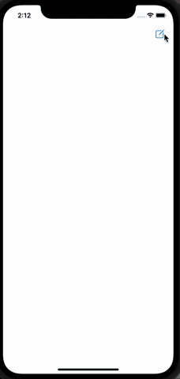

# ColorSettings
## Учебный проэкт
Приложение кастомной настройки цвета экрана.
Настройка цвета происходит путем взаимодействия со слайдарами , отвечающими за 3 основных цвета в палитре ( Красный, Зеленый, Синий).
Каждый слайдер обозначен названием цвета за который он отвечает  и показывает динамическое изменение значения этого цвета, в зависимости от положения слайдера.

## Educational project
Screen color customization app.
Color adjustment occurs by interacting with the sliders responsible for the 3 primary colors in the palette (Red, Green, Blue).
Each slider is indicated by the name of the color for which it is responsible and shows the dynamic change in the value of this color, depending on the position of the slider.

